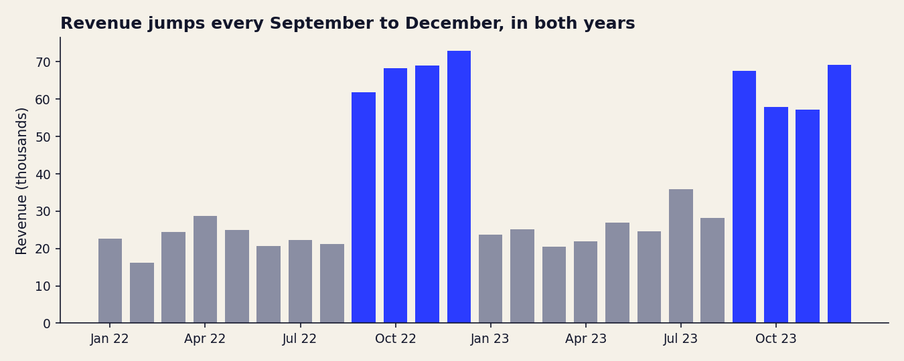

# Retail Sales Analytics Pipeline

A reproducible SQL analysis of two years of retail transactions. One command loads the raw CSV, cleans it with logged rules, runs 13 business queries, and writes results, charts and a findings report.

```bash
pip install -r requirements.txt
python pipeline.py
```

## What it found

Full write-up with every number generated from the data: [`outputs/insights.md`](outputs/insights.md).

- **Sales are seasonal.** September to December brings 57% of revenue in 8 of 24 months, about 2.7x a normal month.
- **Volume drives the peak, not basket size.** Average order value is 461 in peak months and 454 otherwise.
- **Categories are nearly interchangeable.** Revenue differs by 9% between best and worst, with margins within a point of each other.
- **Evenings dominate.** 64% of orders are placed from 5 pm.



## How it works

| Step | File | What happens |
|---|---|---|
| Load | `sql/01_schema.sql` | Reads `data/retail_sales.csv` into a raw table, untouched |
| Clean | `sql/02_cleaning.sql` | Drops rows missing money fields, keeps missing ages, logs every removal to `data_quality_log` |
| Analyse | `sql/03_analysis.sql` | 13 named queries: revenue and profit by category, monthly trend, top customers, shifts, age bands, customer concentration |
| Export | `pipeline.py`, `report.py` | Writes `outputs/results/*.csv`, charts and `insights.md` |
| Verify | `tests/` | Row counts reconcile, revenue identity holds, category and monthly totals match the grand total |

The SQL runs on DuckDB and uses standard constructs (CTEs, window functions, `RANK`, `NTILE`), so it ports to PostgreSQL with `strftime` swapped for `TO_CHAR`.

## Data quality decisions

- 2,000 rows received, 3 dropped because quantity, price, cost or total was missing, 1,997 analysed.
- 10 kept rows have no age. They are excluded from age analysis only, rather than dropping otherwise valid sales.
- No duplicate transaction IDs, and `total_sale` equals `quantity x price_per_unit` on every row.

## Limits

- The equal margins across categories and very regular order values suggest the dataset is synthetic, so the patterns show method rather than market truth.
- Customers 1 to 5 place 63 to 76 orders each against an average of 13, which can indicate placeholder accounts. Customer-level findings should be checked before use.
- Two years cannot separate seasonality from one-off promotions.
- The business question list follows a widely used SQL practice exercise. The cleaning rules, extra analyses, pipeline, tests and findings are my own work.

## Run the tests

```bash
pip install -r requirements-dev.txt
pytest
```

## Author

Vivek Poddar, B.Tech ECE, NIT Kurukshetra. [Portfolio](https://poddarvivek.github.io/) / [LinkedIn](https://www.linkedin.com/in/vivekpoddar-work)
